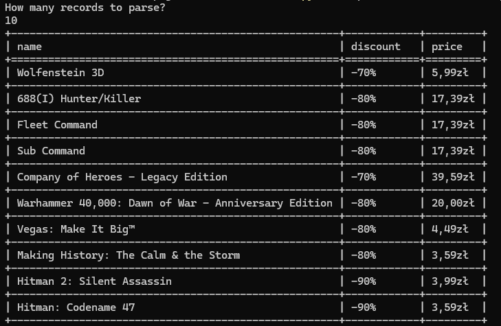

# Another steam sales manager

## Abstract

I often check sales on steam. I have to go into website, look at the images, animations, ads. It's distracting. It's not automated. I just want to run simple script and get most interesting results in most minimalistic way. Just text, name of the game, its discount and price.

## Disclaimer

Option 1 and option 2 have different approaches to get data about steam game sales. But both options will have the same results:
- Creates `output.html` file in project directory, which will show you minimalistic version of the data, without ads, images and all that stuff that is distracting.
- Prints nice table in terminal after running option[1|2] script (read below).

## Installation

TODO: Add specific modules to install

## Option 1 - scrapping

Using selenium we scrap data from page with steam sales. Script also is selecting the most possible amount of records per page.
Just run
```
python script.py
```
to scrap steam db sales from web

## Option 2 - parse source

If https://steamdb.info will block your ip address, or you would have any other problem, you can just get the source of the website with game records, and save it as `source.txt` file in project directory.
This option is also helpful when you want to do custom filtering, ordering, searching or anything to the data before parsing to minimalistic output.

Just run
```
python parse_source_from_file.py
```

That option will also prompt you with `How many records to parse?` (screenshoot). That's the most common way of me using that, because I want to just quickly read top 10 records and move on.

# Screenshoots

## Terminal output

<div align='center'>
    
</div>